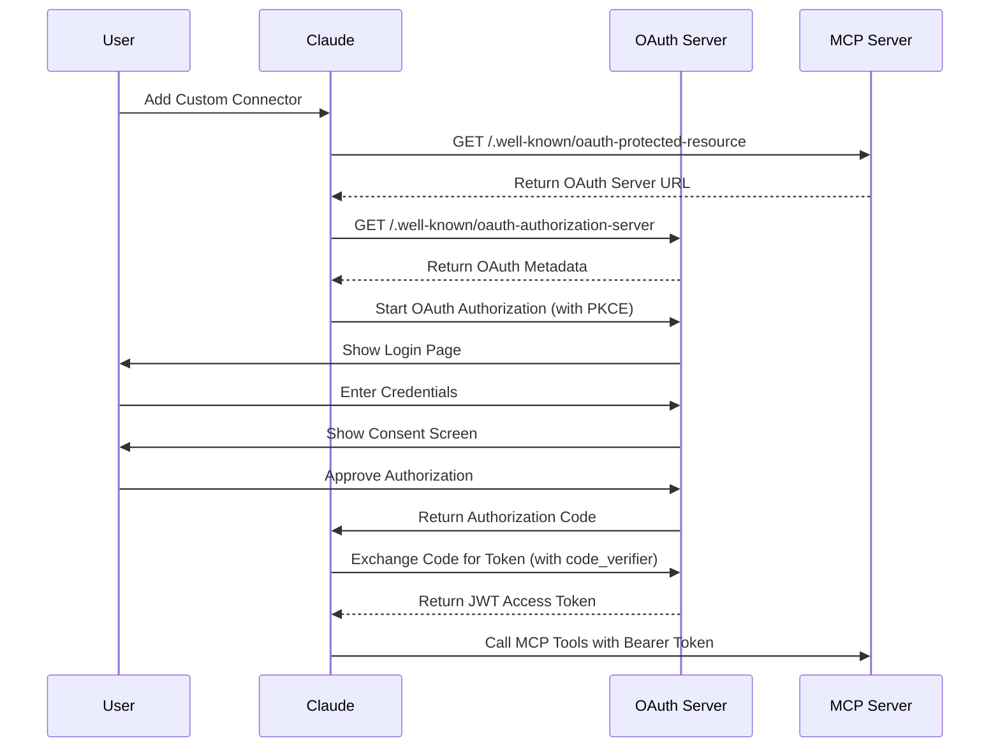

# NewsLeopard MCP Server Documentation

## Server Description

NewsLeopard (電子豹) is Taiwan's leading email marketing and SMS automation platform, serving 15,000+ businesses with 30-40% market share in Taiwan's email marketing industry. The platform processes billions of emails annually with 99%+ deliverability.

The NewsLeopard MCP Server connects your NewsLeopard account to Claude, enabling you to manage email campaigns, view reports, analyze performance, and automate email marketing — all using natural language.

**Server URL:** `https://mcp.newsleopard.com/mcp`

---

## Features

### Campaign Management

- Create, draft, and send email campaigns with interactive forms
- Edit campaign content (text, sections, or full HTML)
- Pause running campaigns
- Pre-flight validation before sending

### Analytics & Reporting

- View campaign performance metrics (open rates, click rates, bounce rates)
- Get AI-powered analysis with optimization recommendations
- Compare multiple campaigns side-by-side
- Track per-link click breakdown and e-commerce revenue data
- Export detailed per-recipient CSV reports

### Contact Management

- View and manage subscriber lists/groups
- Create new contact groups
- See open rate rankings across groups

### Templates & Automation

- Browse and use official and custom email templates
- Save new templates for reuse
- Start and stop automation workflows

### Account Management

- Check sending quota and account balance
- View verified sender addresses
- Get optimal send time recommendations based on historical data

---

## Setup Instructions

### Claude.ai (Web)

> **Requirement:** Claude Pro, Max, Team, or Enterprise plan

1. Go to [Claude.ai](https://claude.ai) and sign in
2. Click your **avatar** (bottom-left) → **Settings** → **Connectors**
3. Scroll to the bottom and click **Add custom connector**
4. Enter the URL:

   ```text
   https://mcp.newsleopard.com/sse
   ```

5. Click **Add** — you will be redirected to the NewsLeopard login page
6. Enter your NewsLeopard credentials and click **Allow** to authorize
7. You will be returned to Claude.ai — the connector shows as **Connected**

After connecting:

- You can enable or disable individual tools in the Connectors settings
- Connectors sync automatically to Claude iOS and Android apps
- No additional setup needed on mobile devices

> **Note:** Claude.ai uses OAuth authentication only (no API Key).

### Claude Desktop

> **Requirement:** Claude Pro, Max, Team, or Enterprise plan

#### Option A: Connectors UI (Recommended)

Same as Claude.ai — uses OAuth, no additional software required:

1. Open Claude Desktop → click your **avatar** → **Settings** → **Connectors**
2. Click **Add custom connector**
3. Enter the URL:

   ```text
   https://mcp.newsleopard.com/sse
   ```

4. Click **Add** — your browser will open for OAuth login
5. Enter your NewsLeopard credentials and authorize
6. Return to Claude Desktop

Connectors added via the UI sync across Claude.ai and mobile devices.

#### Option B: mcp-remote (API Key)

For API Key authentication, use the `mcp-remote` bridge. Requires [Node.js](https://nodejs.org/).

Config file location:

- **macOS:** `~/Library/Application Support/Claude/claude_desktop_config.json`
- **Windows:** `%APPDATA%\Claude\claude_desktop_config.json`

```json
{
  "mcpServers": {
    "newsleopard": {
      "command": "npx",
      "args": [
        "mcp-remote@latest",
        "https://mcp.newsleopard.com/sse",
        "--header",
        "x-api-key: ${NEWSLEOPARD_API_KEY}"
      ],
      "env": {
        "NEWSLEOPARD_API_KEY": "your_api_key_here"
      }
    }
  }
}
```

Restart Claude Desktop after saving. The MCP server icon should appear in the chat input area.

### Claude Code (CLI)

Claude Code connects via OAuth automatically:

```bash
claude mcp add newsleopard --transport http https://mcp.newsleopard.com/mcp
```

The OAuth flow triggers on first use. A local callback server runs on port 6274.

### Cursor

1. Open **Settings** → **MCP** → **New MCP Server**
2. Enter:

```yaml
Name: NewsLeopard
URL: https://mcp.newsleopard.com/mcp
Headers:
  x-api-key: YOUR_NEWSLEOPARD_API_KEY
```

---

## Authentication

The server supports OAuth 2.1 with PKCE (primary) and API Key (legacy fallback).

### OAuth 2.1 (Recommended)

| Parameter | Value |
| --- | --- |
| Authorization Endpoint | `https://auth.newsleopard.com/oauth/authorize` |
| Token Endpoint | `https://auth.newsleopard.com/oauth/token` |
| Dynamic Client Registration | `https://auth.newsleopard.com/oauth/register` |
| JWKS | `https://auth.newsleopard.com/.well-known/jwks.json` |
| Server Metadata (RFC 8414) | `https://auth.newsleopard.com/.well-known/oauth-authorization-server` |
| Protected Resource (RFC 9728) | `https://mcp.newsleopard.com/.well-known/oauth-protected-resource` |
| Response Type | `code` |
| Code Challenge Method | `S256` (PKCE required) |
| Grant Types | `authorization_code`, `refresh_token` |
| Token Auth Method | `none` (public client with PKCE) |
| Scopes | `mcp:read mcp:write` |
| Access Token Lifetime | 30 minutes |
| Refresh Token Lifetime | 30 days |
| Token Format | RS256 JWT |

### API Key (Legacy)

For tools that don't support OAuth (e.g., Cursor, VS Code extensions):

1. Log in to NewsLeopard: [https://www.newsleopard.com/login](https://www.newsleopard.com/login)
2. Go to **Settings** → **API Settings**
3. Click **Generate new API Key**
4. Use the key in the `x-api-key` header

> API Keys should not be shared. They provide full access to your account data.

### OAuth Flow Diagram



---

## Usage Examples

### Example 1: View Recent Campaign Performance

**Prompt:**

```text
Show me how my recent email campaigns performed
```

**What happens:** Claude calls `get_recent_campaigns_summary` and returns a table of the 10 most recent campaigns with campaign name, send date, recipient count, open rate, click rate, bounce rate, and unsubscribe count — helping you quickly assess which campaigns performed best.

### Example 2: Create a New Email Campaign

**Prompt:**

```text
Create a new newsletter for my VIP customers about our spring sale
```

**What happens:** Claude orchestrates a multi-step workflow:

1. Checks available sender addresses (`get_verified_senders`)
2. Finds the "VIP" contact group (`get_lists`)
3. Opens an interactive campaign creation form (`draft_campaign`) where you select the sender, recipient list, subject line, and HTML content

### Example 3: Analyze Campaign and Get Optimization Tips

**Prompt:**

```text
Analyze my last campaign and give me tips to improve
```

**What happens:** Claude retrieves your latest campaign (`get_recent_campaigns_summary`), then runs a deep analysis (`analyze_campaign`) covering open rate vs. industry benchmarks, click-through analysis, bounce assessment, and AI-generated recommendations for subject lines, send time, content, and list hygiene.

### Example 4: Compare Multiple Campaigns

**Prompt:**

```text
Compare my last 3 campaigns side by side
```

**What happens:** Claude fetches recent campaigns and runs `compare_campaigns` to produce a side-by-side view of metrics, performance trends, and recommendations based on comparative patterns.

### Example 5: Check Account Status and Best Send Time

**Prompt:**

```text
How many emails can I still send this month? When is the best time to send?
```

**What happens:** Claude checks your quota (`get_account_balance`) and analyzes historical engagement data (`get_best_send_time`) to recommend the optimal day and time for your next campaign.

---

## Available Tools

The server provides 27 public tools, all with safety annotations.

### Read-Only Tools (readOnlyHint: true)

| Tool | Description |
| --- | --- |
| `get_tool_guide` | Categorized guide to all available tools |
| `get_lists` | Query contact lists/groups with subscriber counts |
| `get_top_lists` | Contact lists ranked by open rate |
| `get_campaigns` | Query sent email campaigns with metrics |
| `get_campaign_report` | Detailed performance report for a campaign |
| `get_campaign_status` | Campaign delivery progress |
| `analyze_campaign` | AI-powered analysis with optimization suggestions |
| `get_account_balance` | Email sending quota and balance |
| `get_templates` | List user-created email templates |
| `get_official_templates` | List official NewsLeopard templates |
| `get_template` | Get specific template content |
| `get_click_details` | Per-link click breakdown |
| `get_campaign_bounces` | Bounce details with type and reason |
| `get_campaign_unsubscribes` | Unsubscribe details with reason |
| `get_campaign_ecommerce` | GA4 e-commerce revenue data |
| `get_campaign_content` | Get full HTML of a campaign |
| `get_recent_campaigns_summary` | Performance summary of recent campaigns |
| `compare_campaigns` | Side-by-side comparison of 2-5 campaigns |
| `get_verified_senders` | List verified sender addresses |
| `get_best_send_time` | Recommended send time from historical data |
| `find_campaigns` | Search campaigns by status, keyword, or date |
| `export_campaign_details` | Start async export of per-recipient CSV |
| `get_export_download` | Get download links for exported files |
| `preflight_check_campaign` | Pre-send validation check |

### Write Tools (destructiveHint: false)

| Tool | Description |
| --- | --- |
| `create_list` | Create a new contact list/group |
| `draft_campaign` | Create new campaign with interactive form |
| `update_campaign_content` | Edit campaign content |
| `save_template` | Save HTML content as reusable template |

### Destructive Tools (destructiveHint: true)

| Tool | Description |
| --- | --- |
| `pause_campaign` | Pause a running campaign |
| `start_automation` | Activate an automation workflow |
| `stop_automation` | Stop a running automation workflow |

---

## Privacy Policy

[https://www.newsleopard.com/legal/privacy-policy/](https://www.newsleopard.com/legal/privacy-policy/)

**Data practices:**

- The MCP server collects only the data necessary to fulfill tool requests (campaign IDs, list IDs, etc.)
- No conversation data is stored
- All communication uses HTTPS with TLS 1.2+
- API keys are logged with only the first 8 characters for debugging

---

## Support

- **Email:** [service@newsleopard.tw](mailto:service@newsleopard.tw)
- **Website:** [https://www.newsleopard.com](https://www.newsleopard.com)
- **API Documentation:** [https://newsleopard.com/api/v1/](https://newsleopard.com/api/v1/)

---

## FAQ

### Claude.ai doesn't show the Connectors option

Custom Connectors require a Claude Pro, Max, Team, or Enterprise plan. Free plans do not support this feature.

### Connection fails with a 401 error

- **Claude.ai:** Ensure you completed the OAuth login and authorization.
- **Claude Desktop / Cursor:** Verify your API Key is correct and not expired.

### Claude Desktop doesn't show NewsLeopard tools

1. Confirm the config file has valid JSON syntax
2. Ensure Node.js is installed
3. Fully quit and restart Claude Desktop
4. Check logs:
   - macOS: `~/Library/Logs/Claude/mcp*.log`
   - Windows: `%APPDATA%\Claude\logs\mcp*.log`

### Responses are slow

The MCP server connects to the NewsLeopard API over the network. First requests may take 2-3 seconds due to cold start; subsequent requests are faster.

---

## References

- [MCP Directory Submission Guide](https://support.claude.com/en/articles/12922490-remote-mcp-server-submission-guide)
- [Getting Started with Custom Connectors](https://support.claude.com/en/articles/11175166-getting-started-with-custom-connectors-using-remote-mcp)
- [Building Remote MCP Servers](https://support.claude.com/en/articles/11503834-building-custom-connectors-via-remote-mcp-servers)
- [MCP Authorization Specification](https://spec.modelcontextprotocol.io/specification/2025-03-26/basic/authorization/)
- [MCP Protocol Documentation](https://modelcontextprotocol.io/)
